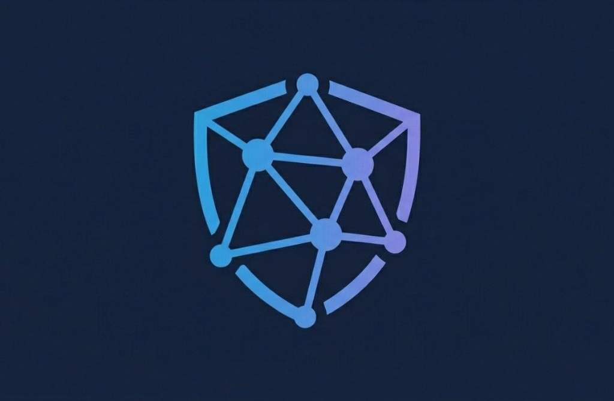

# 🔍 Supply Chain Fraud Intelligence

> **Real-time fraud intelligence platform** powered by Graph Analytics and Google Gemini AI. Detects fraudulent seller networks, shell entities, and high-risk actors across e-commerce supply chains with automated AI-driven risk explanations.



---

## 🎯 Project Overview

This platform provides a high-fidelity dashboard for identifying organized seller fraud rings. By combining structural graph analytics (PageRank, Louvain, WCC) with Generative AI (Google Gemini), the system not only flags suspicious entities but also generates natural language explanations for the underlying fraud risk.

### 💡 Key Features
- **AI Fraud Analyst**: Integrated chat interface powered by **Gemini 1.5 Flash** for deep-diving into seller data.
- **AI Risk Explainer**: Context-aware fraud risk justifications for every flagged entity.
- **Graph-Powered Detection**: Identifies hidden relationships, shared bank accounts, and collusion clusters.
- **Premium UI**: Minimalist, high-performance dashboard built with React and Tailwind CSS.
- **Secure Backend**: Centralized Django API architecture with protected environment variables.

---

## 🏗️ Tech Stack

| Component | Technology |
|---|---|
| **Frontend** | React (Vite), Tailwind CSS 4, Plotly.js |
| **Backend** | Django, Django REST Framework, django-environ |
| **AI Orchestration** | Google AI Studio (Gemini 1.5 Flash / Latest) |
| **Analytics Engine** | Python, Graph Algorithms (PageRank, Louvain, WCC) |
| **Typography** | Inter |

---

## ⚙️ Architecture

```
┌─────────────────────────────────┐      ┌──────────────────────────────┐
│       React Frontend            │      │       Django Backend         │
│ (Vite, Tailwind, Plotly)        │◄────►│ (REST API, logic, Security)  │
└─────────────────────────────────┘      └──────────────┬───────────────┘
                                                       │
                                                       ▼
                                         ┌──────────────────────────────┐
                                         │      Google AI Studio        │
                                         │      (Gemini API)            │
                                         └──────────────────────────────┘
```

---

## 🚀 Getting Started

### Prerequisites
- Python 3.11+
- Node.js 18+
- Google AI Studio API Key ([Get one here](https://aistudio.google.com/))

### 1. Backend Setup
```bash
# Navigate to the project root
cd Supply-Chain-Fraud-Intelligence

# Create and activate virtual environment
python -m venv venv
source venv/Scripts/activate  # On Windows

# Install dependencies
pip install -r requirements.txt

# Create a .env file in the root
GEMINI_API_KEY=your_actual_key_here

# Run migrations (if any) and start the server
python manage.py runserver
```

### 2. Frontend Setup
```bash
# Navigate to the frontend directory
cd react-frontend

# Install dependencies
npm install

# Start the development server
npm run dev
```

---

## 🧠 AI Integration

The system uses **Gemini 1.5 Flash** to analyze complex supply chain data points including:
- **Return Rate Anomalies**: High volume returns vs. industry benchmarks.
- **Graph Centrality**: PageRank scores indicating disproportionate network influence.
- **Community Clustering**: Louvain IDs revealing suspicious affiliation with known fraud rings.
- **Entity Resolution**: WCC components identifying shared financial infrastructure.

---

## 👤 Credits

**Fullstack Ninjas Team**
- **Arpit Raj** — [@Arpit599222](https://github.com/Arpit599222)
- **Richa Grover** — [@RichaACN](https://github.com/RichaACN)
- **Paras Jain** — [@ParasJain03](https://github.com/ParasJain03)

---

## 📄 License

This project is licensed under the MIT License — see the [LICENSE](LICENSE) file for details.

---

*Built with ❄️ Data · 🤖 Google Gemini · ⚛️ React*
